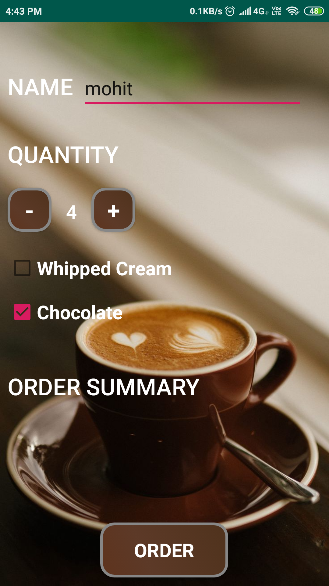
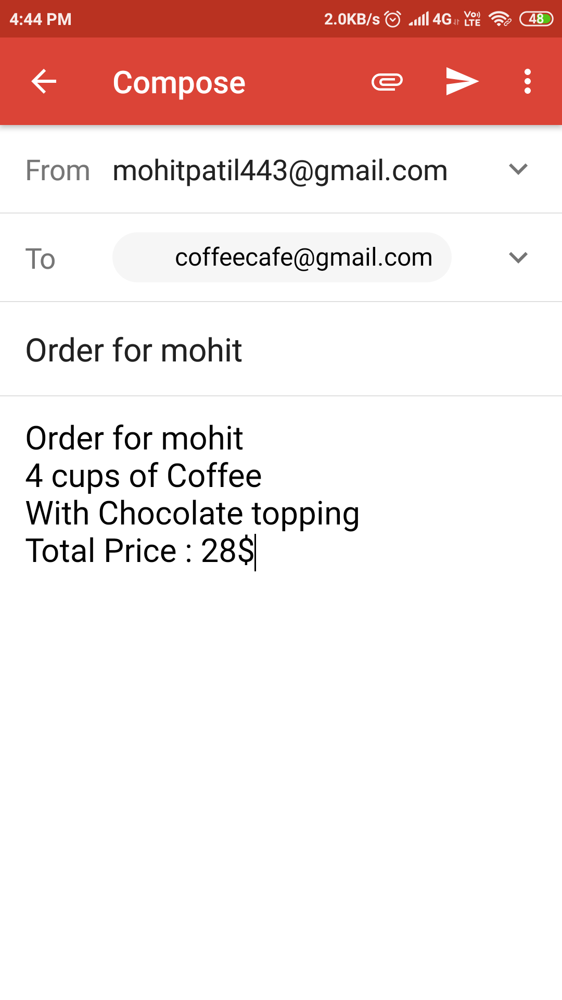

# Cofee-Order
This Version of the app allows the user to order number of coffees.
It takes the number of coffees,additional flavours as an input and calculate the price according to it.
It sends an intent to Gmail with the order summmary of the user.
The cafe receives the user order through gmail.

Below is a link to see the app live in action: 
 

<pre>                                 </pre>

